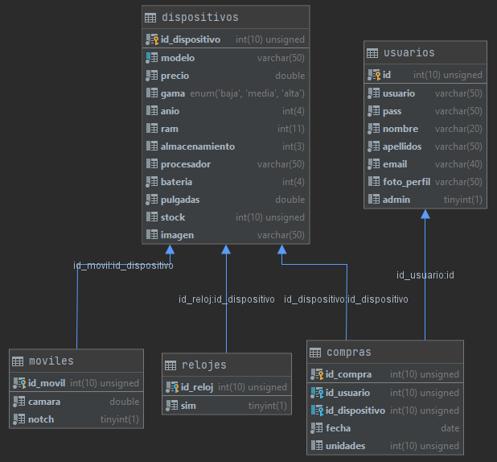

# P3 Project
## Autores
- [Daniel Garcia](https://github.com/danielgv93)
- [Joseba Mantecon](https://github.com/josebamango)
- Puedes encontrar el proyecto [aquí](https://github.com/danielgv93/TiendaPhp)

## Documentación
### Diagrama UML


### Funciones de base de datos (Ampliaciones primera version)
1. ***Modificar stock del producto:***

Se elige un modelo desde un desplegable y se actualiza el stock al nivel que se establezca con un UPDATE.
```php
function updateStock($id, $stock)
    {
        $conexion = self::getConexion();
        $sql = /** @lang MariaDB */
            "UPDATE dispositivos SET stock = ? WHERE id_dispositivo = ?;";
        $consulta = $conexion->prepare($sql);
        $consulta->bindParam(1, $stock);
        $consulta->bindParam(2, $id);
        if ($consulta->execute() != true) throw new Exception("No se ha podido actualizar el stock");
        return true;
    }
```
2. ***Insertar movil:***

Se inserta un móvil con todos sus campos, pero antes se comprueba que no existe ya en la base de datos y si no está se 
inserta mediante una transacción. Primero en la tabla de dispositivos, y después en la de móviles.
```php
function addMovil($movil)
    {
        $conexion = self::getConexion();
        /* SE COMPRUEBA QUE NO HAY UN MISMO MODELO EN LA BASE DE DATOS */
        $sql = /** @lang MariaDB */
            "SELECT COUNT(*) as iguales from dispositivos where modelo = ?;";
        $resultado = $conexion->prepare($sql);
        $resultado->bindValue(1, $movil->getModelo());
        $resultado->execute();
        $fila = $resultado->fetch();
        if ($fila["iguales"] != 0) {
            throw new Exception("Ya hay un modelo igual en la base de datos");
        }
        /* SE HACE INSERT CON TRANSACCIÓN EN dispositivos Y moviles */
        $conexion->beginTransaction();
        try {
            $sql = /** @lang MariaDB */
                "INSERT INTO dispositivos (modelo, precio, gama, anio, ram, almacenamiento, procesador, bateria, pulgadas, imagen)
                    VALUES (?, ?, ?, ?, ?, ?, ?, ?, ?, ?);";
            $insert = $conexion->prepare($sql);
            $insert->bindValue(1, $movil->getModelo());
            $insert->bindValue(2, $movil->getPrecio());
            $insert->bindValue(3, $movil->getGama());
            $insert->bindValue(4, $movil->getAnio());
            $insert->bindValue(5, $movil->getRam());
            $insert->bindValue(6, $movil->getAlmacenamiento());
            $insert->bindValue(7, $movil->getProcesador());
            $insert->bindValue(8, $movil->getBateria());
            $insert->bindValue(9, $movil->getPulgadas());
            $insert->bindValue(10, $movil->getImagen());
            if ($insert->execute() == false) {
                throw new Exception("Error al insertar el dispositivo");
            }
            $sql = /** @lang MariaDB */
                "INSERT INTO moviles (id_movil, camara, notch) VALUES 
                    ((SELECT id_dispositivo from dispositivos order by id_dispositivo desc limit 1), ?, ?);";
            $insert = $conexion->prepare($sql);
            $insert->bindValue(1, $movil->getCamara());
            $insert->bindValue(2, $movil->getNotch());
            if ($insert->execute() == false) {
                throw new Exception("Error al insertar el movil");
            }
            $conexion->commit();
            return true;
        } catch (Exception $e) {
            $conexion->rollBack();
            return false;
        }
    }
```

3. ***Insertar reloj:***

Se inserta un reloj con todos sus campos, pero antes se comprueba que no existe ya en la base de datos y si no está se 
inserta mediante una transacción. Primero en la tabla de dispositivos, y después en la de relojes.
```php
function addReloj($reloj)
    {
        $conexion = self::getConexion();
        /* SE COMPRUEBA QUE NO HAY UN MISMO MODELO EN LA BASE DE DATOS */
        $sql = /** @lang MariaDB */
            "SELECT COUNT(*) as iguales from dispositivos where modelo = ?;";
        $resultado = $conexion->prepare($sql);
        $resultado->bindValue(1, $reloj->getModelo());
        $resultado->execute();
        $fila = $resultado->fetch();
        if ($fila["iguales"] != 0) {
            throw new Exception("Ya hay un modelo igual en la base de datos");
        }
        /* SE HACE INSERT CON TRANSACCIÓN EN dispositivos Y relojes */
        $conexion->beginTransaction();
        try {
            $sql = /** @lang MariaDB */
                "INSERT INTO dispositivos (modelo, precio, gama, anio, ram, almacenamiento, procesador, bateria, pulgadas, imagen)
                    VALUES (?, ?, ?, ?, ?, ?, ?, ?, ?, ?);";
            $insert = $conexion->prepare($sql);
            $insert->bindValue(1, $reloj->getModelo());
            $insert->bindValue(2, $reloj->getPrecio());
            $insert->bindValue(3, $reloj->getGama());
            $insert->bindValue(4, $reloj->getAnio());
            $insert->bindValue(5, $reloj->getRam());
            $insert->bindValue(6, $reloj->getAlmacenamiento());
            $insert->bindValue(7, $reloj->getProcesador());
            $insert->bindValue(8, $reloj->getBateria());
            $insert->bindValue(9, $reloj->getPulgadas());
            $insert->bindValue(10, $reloj->getImagen());
            if ($insert->execute() == false) {
                throw new Exception("Error al insertar el dispositivo");
            }
            $sql = /** @lang MariaDB */
                "INSERT INTO relojes (id_reloj, sim) VALUES 
                    ((SELECT id_dispositivo from dispositivos order by id_dispositivo desc limit 1), ?);";
            $insert = $conexion->prepare($sql);
            $insert->bindValue(1, $reloj->getSim());
            if ($insert->execute() == false) {
                throw new Exception("Error al insertar el reloj");
            }
            $conexion->commit();
            return true;
        } catch (Exception $e) {
            $conexion->rollBack();
            return false;
        }
    }
```

4. ***Borrar dispositivo:***

Se selecciona un dispositivo desde un desplegable y a traves de su id se borra mediante una consulta.
```php
function borrarModelo($id)
    {
        $conexion = self::getConexion();
        $sql = /** @lang MariaDB */
            "DELETE FROM dispositivos WHERE id_dispositivo = ?;";
        $delete = $conexion->prepare($sql);
        $delete->bindValue(1, $id);
        if ($delete->execute() == false) {
            throw new Exception("No se pudo borrar el modelo seleccionado");
        }
        return true;
    }
```

5. ***Buscador de productos:***

Buscador en el que se introduce el nombre del modelo y a través de la función getDispositivos() recoge todos los 
dispositivos de la base de datos y se comprueba si existe el nombre del modelo total o parcialmente. Si no existe, 
muestra todos los dispositivos que hay.
```php
function getDispositivos()
    {
        $conexion = self::getConexion();
        $sql = /** @lang MariaDB */
            "SELECT * from dispositivos order by modelo";
        $resultado = $conexion->query($sql);
        $resultado->bindColumn(1, $id);
        $resultado->bindColumn(2, $modelo);
        $resultado->bindColumn(3, $precio);
        $resultado->bindColumn(4, $gama);
        $resultado->bindColumn(5, $anio);
        $resultado->bindColumn(6, $ram);
        $resultado->bindColumn(7, $almacenamiento);
        $resultado->bindColumn(8, $procesador);
        $resultado->bindColumn(9, $bateria);
        $resultado->bindColumn(10, $pulgadas);
        $resultado->bindColumn(11, $stock);
        $resultado->bindColumn(12, $imagen);
        while ($resultado->fetch(PDO::FETCH_BOUND)) {
            $datos[$id] = new Dispositivo($id, $modelo, $precio, $gama, $anio, $ram, $almacenamiento, $procesador,
                $bateria, $pulgadas, $stock, $imagen);
        }
        return $datos;
    }
```

6. ***Ver ficha:***

A través del id del dispositivo se retorna si es móvil o reloj, y con esa información se realiza la función getMovil() 
o getReloj() y se muestra la ficha de información ampliada en una página nueva.
```php
function getFicha($id)
    {
        if (self::getTipoDispositivo($id) == "movil") {
            return [self::getMovil($id), "movil"];
        } else {
            return [self::getReloj($id), "reloj"];
        }
    }

    function getTipoDispositivo($id)
    {
        $conexion = self::getConexion();
        $sql = /** @lang MariaDB */
            "SELECT COUNT(*) as iguales from moviles where id_movil = ?;";
        $resultado = $conexion->prepare($sql);
        $resultado->bindParam(1, $id);
        $resultado->execute();
        $fila = $resultado->fetch();
        if ($fila["iguales"] != 0) {
            return "movil";
        }
        return "reloj";
    }

```

7. ***Busqueda por categoria:***

Al clickar sobre la categoría retorna la lista de móviles o relojes y la muestra entera.
```php
function getRelojes()
    {
        $conexion = self::getConexion();
        $sql = /** @lang MariaDB */
            "SELECT * from dispositivos d inner join relojes m on d.id_dispositivo = m.id_reloj order by modelo;";
        $resultado = $conexion->query($sql);
        $resultado->bindColumn(1, $id);
        $resultado->bindColumn(2, $modelo);
        $resultado->bindColumn(3, $precio);
        $resultado->bindColumn(4, $gama);
        $resultado->bindColumn(5, $anio);
        $resultado->bindColumn(6, $ram);
        $resultado->bindColumn(7, $almacenamiento);
        $resultado->bindColumn(8, $procesador);
        $resultado->bindColumn(9, $bateria);
        $resultado->bindColumn(10, $pulgadas);
        $resultado->bindColumn(11, $stock);
        $resultado->bindColumn(12, $imagen);
        $resultado->bindColumn(13, $idReloj);
        $resultado->bindColumn(14, $sim);
        while ($resultado->fetch(PDO::FETCH_BOUND)) {
            $datos[$id] = new Reloj($id, $modelo, $precio, $gama, $anio, $ram, $almacenamiento, $procesador, $bateria,
            $pulgadas, $stock, $imagen, $idReloj, $sim);
        }
        return $datos;
    }

function getMoviles()
    {
        $conexion = self::getConexion();
        $sql = /** @lang MariaDB */
            "SELECT * from dispositivos d inner join moviles m on d.id_dispositivo = m.id_movil order by modelo;";
        $resultado = $conexion->query($sql);
        $resultado->bindColumn(1, $id);
        $resultado->bindColumn(2, $modelo);
        $resultado->bindColumn(3, $precio);
        $resultado->bindColumn(4, $gama);
        $resultado->bindColumn(5, $anio);
        $resultado->bindColumn(6, $ram);
        $resultado->bindColumn(7, $almacenamiento);
        $resultado->bindColumn(8, $procesador);
        $resultado->bindColumn(9, $bateria);
        $resultado->bindColumn(10, $pulgadas);
        $resultado->bindColumn(11, $stock);
        $resultado->bindColumn(12, $imagen);
        $resultado->bindColumn(13, $idMovil);
        $resultado->bindColumn(14, $camara);
        $resultado->bindColumn(15, $notch);
        while ($resultado->fetch(PDO::FETCH_BOUND)) {
            $datos[$id] = new Movil($id, $modelo, $precio, $gama, $anio, $ram, $almacenamiento, $procesador, $bateria,
            $pulgadas, $stock, $imagen, $idMovil, $camara, $notch);
        }
        return $datos;
    }
```


### Funciones de base de datos (Ampliaciones ultima version)
1. ***Actualizar usuario:*** 
   
Actualiza todos las propiedades del usuario, excepto la imagen y el rol. Devuelve true si se
    actualiza con exito, false en caso contrario.
```php
function updateUsuario($id, $nombre, $apellidos, $usuario, $email, $contraseña)
    {
        $conexion = self::getConexion();
        $sql = /** @lang MariaDB */
            "UPDATE usuarios SET nombre = ?, apellidos = ?, usuario = ?, email = ?, pass = MD5(?)  WHERE id = ?;";
        $consulta = $conexion->prepare($sql);
        $consulta->bindParam(1, $nombre);
        $consulta->bindParam(2, $apellidos);
        $consulta->bindParam(3, $usuario);
        $consulta->bindParam(4, $email);
        $consulta->bindParam(5, $contraseña);
        $consulta->bindParam(6, $id);
        if ($consulta->execute()){
            return true;
        }
        return false;
    }
```

2. ***Actualizar foto usuario:*** 
   
Pasando la ubicacion de la imagen en el proyecto y el id del usuario, 
   actualiza la foto de perfil. 
```php
function updateFotoUsuario($id, $imagen)
    {
        $conexion = self::getConexion();
        $sql = /** @lang MariaDB */
            "UPDATE usuarios SET foto_perfil = ?  WHERE id = ?;";
        $consulta = $conexion->prepare($sql);
        $consulta->bindParam(1, $imagen);
        $consulta->bindParam(2, $id);
        if ($consulta->execute()){
            return true;
        }
        return false;
    }
```
La imagen de perfil es movida desde la ubicacion del fichero temporal y utiliza dicha localizacion para guardarla en 
base de datos gracias a estas dos funciones:
```php
function guardarImagenUsuario($nombreUsuario, $archivoImagen)
{
    $targetFile = "img/usuarios/" . $nombreUsuario . "." . getExtension($archivoImagen["type"]);
    if (!file_exists($archivoImagen["tmp_name"])) {
        throw new Exception("Elige imagen para subir");
    }
    if (move_uploaded_file($archivoImagen["tmp_name"], $targetFile)) {
        return $targetFile;
    }
    return false;
}

function getExtension($tipoImagen)
{
    try {
        if ($tipoImagen == null) {
            throw new Exception("Elige una imagen");
        }
        return explode("/", $tipoImagen)[1];
    } catch (Exception $e) {
    }
}
```

3. ***Registrar compra:*** 
   
Pasando un objeto de la clase Compra, la funcion intenta ejecutar 3 consultas en una transaccion.
   Primero inserta la compra en la base de datos. Después extrae el stock del dispositivo en cuestion. Por ultimo, si el
   stock es mayor a la cantidad de unidades que compramos, se actualiza el stock del dispositivo restando las unidades compradas.
   Si cualquiera de estas 3 consultas no se ejecuta como es debido, se hace rollback y retorna una excepcion.

```php
function registrarCompra_RetirarStock($compra)
    {
        $conexion = self::getConexion();
        try {
            $conexion->beginTransaction();
            $sql = /** @lang MariaDB */
                "INSERT INTO compras (id_usuario, id_dispositivo, fecha, unidades) VALUES (?,?,?,?)";
            $consulta = $conexion->prepare($sql);
            $consulta->bindValue(1, $compra->getIdUsuario());
            $consulta->bindValue(2, $compra->getIdDispositivo());
            $consulta->bindValue(3, $compra->getFecha());
            $consulta->bindValue(4, $compra->getUnidades());
            if ($consulta->execute() != true) {
                throw new Exception("Error al registrar la compra");
            }
            $sql = /** @lang MariaDB */
                "SELECT stock FROM dispositivos WHERE id_dispositivo = ?;";
            $consulta = $conexion->prepare($sql);
            $consulta->bindValue(1, $compra->getIdDispositivo());
            $consulta->execute();
            $consulta->bindColumn(1, $stockTienda);
            $consulta->fetch(PDO::FETCH_BOUND);
            if ($stockTienda < $compra->getUnidades()) {
                throw new Exception("No se ha realizado la compra. Stock menor al elegido");
            }
            $sql = /** @lang MariaDB */
                "UPDATE dispositivos SET stock = (stock - ?) WHERE id_dispositivo = ?;";
            $consulta = $conexion->prepare($sql);
            $consulta->bindValue(1, $compra->getUnidades());
            $consulta->bindValue(2, $compra->getIdDispositivo());
            if ($consulta->execute() != true) {
                throw new Exception("Error al actualizar el stock");
            }
            $conexion->commit();
            return true;
        } catch (Exception $e) {
            $conexion->rollBack();
            return $e->getMessage();
        }
    }
```
4. ***Visualizar historial de compras:*** 

Pasando por parametro la id del usuario, recogemos en un array tanto los atributos de la clase Compra, ademas de una variable
extra que es la imagen (para ello acudimos a dos tablas diferentes). Devolvemos un array que contiene un array por cada
dispositivo comprado.
```php
function getHistorial($idUsuario)
    {

        $conexion = self::getConexion();
        $datos = null;
        $sql = /** @lang MariaDB */
            "SELECT id_compra, c.id_dispositivo, imagen, modelo, precio, unidades, fecha from dispositivos d left join compras c on d.id_dispositivo = c.id_dispositivo where c.id_usuario = ?;";
        $resultado = $conexion->prepare($sql);
        $resultado->bindParam(1, $idUsuario);
        $resultado->execute();
        $resultado->bindColumn(1, $idCompra);
        $resultado->bindColumn(2, $id);
        $resultado->bindColumn(3, $imagen);
        $resultado->bindColumn(4, $modelo);
        $resultado->bindColumn(5, $precio);
        $resultado->bindColumn(6, $cantidad);
        $resultado->bindColumn(7, $fecha);
        while ($resultado->fetch(PDO::FETCH_BOUND)) {
            $datos[] = array(
                "id_compra" => $idCompra, "id"=> $id, "imagen" => $imagen,"modelo" => $modelo, "precio" => $precio, "cantidad"=>$cantidad, "fecha"=>$fecha
            );
        }

        return $datos;
    }
```
# P3 Project
##Autores
- [Daniel Garcia](https://github.com/danielgv93)
- [Joseba Mantecon](https://github.com/josebamango)
- Puedes encontrar el proyecto [aquí](https://github.com/danielgv93/TiendaPhp)

## Documentación
### Diagrama UML


### Funciones de base de datos (Ampliaciones primera version)
1. ***Modificar stock del producto:***

Se elige un modelo desde un desplegable y se actualiza el stock al nivel que se establezca con un UPDATE.
```php
function updateStock($id, $stock)
    {
        $conexion = self::getConexion();
        $sql = /** @lang MariaDB */
            "UPDATE dispositivos SET stock = ? WHERE id_dispositivo = ?;";
        $consulta = $conexion->prepare($sql);
        $consulta->bindParam(1, $stock);
        $consulta->bindParam(2, $id);
        if ($consulta->execute() != true) throw new Exception("No se ha podido actualizar el stock");
        return true;
    }
```
2. ***Insertar movil:***

Se inserta un móvil con todos sus campos, pero antes se comprueba que no existe ya en la base de datos y si no está se 
inserta mediante una transacción. Primero en la tabla de dispositivos, y después en la de móviles.
```php
function addMovil($movil)
    {
        $conexion = self::getConexion();
        /* SE COMPRUEBA QUE NO HAY UN MISMO MODELO EN LA BASE DE DATOS */
        $sql = /** @lang MariaDB */
            "SELECT COUNT(*) as iguales from dispositivos where modelo = ?;";
        $resultado = $conexion->prepare($sql);
        $resultado->bindValue(1, $movil->getModelo());
        $resultado->execute();
        $fila = $resultado->fetch();
        if ($fila["iguales"] != 0) {
            throw new Exception("Ya hay un modelo igual en la base de datos");
        }
        /* SE HACE INSERT CON TRANSACCIÓN EN dispositivos Y moviles */
        $conexion->beginTransaction();
        try {
            $sql = /** @lang MariaDB */
                "INSERT INTO dispositivos (modelo, precio, gama, anio, ram, almacenamiento, procesador, bateria, pulgadas, imagen)
                    VALUES (?, ?, ?, ?, ?, ?, ?, ?, ?, ?);";
            $insert = $conexion->prepare($sql);
            $insert->bindValue(1, $movil->getModelo());
            $insert->bindValue(2, $movil->getPrecio());
            $insert->bindValue(3, $movil->getGama());
            $insert->bindValue(4, $movil->getAnio());
            $insert->bindValue(5, $movil->getRam());
            $insert->bindValue(6, $movil->getAlmacenamiento());
            $insert->bindValue(7, $movil->getProcesador());
            $insert->bindValue(8, $movil->getBateria());
            $insert->bindValue(9, $movil->getPulgadas());
            $insert->bindValue(10, $movil->getImagen());
            if ($insert->execute() == false) {
                throw new Exception("Error al insertar el dispositivo");
            }
            $sql = /** @lang MariaDB */
                "INSERT INTO moviles (id_movil, camara, notch) VALUES 
                    ((SELECT id_dispositivo from dispositivos order by id_dispositivo desc limit 1), ?, ?);";
            $insert = $conexion->prepare($sql);
            $insert->bindValue(1, $movil->getCamara());
            $insert->bindValue(2, $movil->getNotch());
            if ($insert->execute() == false) {
                throw new Exception("Error al insertar el movil");
            }
            $conexion->commit();
            return true;
        } catch (Exception $e) {
            $conexion->rollBack();
            return false;
        }
    }
```

3. ***Insertar reloj:***

Se inserta un reloj con todos sus campos, pero antes se comprueba que no existe ya en la base de datos y si no está se 
inserta mediante una transacción. Primero en la tabla de dispositivos, y después en la de relojes.
```php
function addReloj($reloj)
    {
        $conexion = self::getConexion();
        /* SE COMPRUEBA QUE NO HAY UN MISMO MODELO EN LA BASE DE DATOS */
        $sql = /** @lang MariaDB */
            "SELECT COUNT(*) as iguales from dispositivos where modelo = ?;";
        $resultado = $conexion->prepare($sql);
        $resultado->bindValue(1, $reloj->getModelo());
        $resultado->execute();
        $fila = $resultado->fetch();
        if ($fila["iguales"] != 0) {
            throw new Exception("Ya hay un modelo igual en la base de datos");
        }
        /* SE HACE INSERT CON TRANSACCIÓN EN dispositivos Y relojes */
        $conexion->beginTransaction();
        try {
            $sql = /** @lang MariaDB */
                "INSERT INTO dispositivos (modelo, precio, gama, anio, ram, almacenamiento, procesador, bateria, pulgadas, imagen)
                    VALUES (?, ?, ?, ?, ?, ?, ?, ?, ?, ?);";
            $insert = $conexion->prepare($sql);
            $insert->bindValue(1, $reloj->getModelo());
            $insert->bindValue(2, $reloj->getPrecio());
            $insert->bindValue(3, $reloj->getGama());
            $insert->bindValue(4, $reloj->getAnio());
            $insert->bindValue(5, $reloj->getRam());
            $insert->bindValue(6, $reloj->getAlmacenamiento());
            $insert->bindValue(7, $reloj->getProcesador());
            $insert->bindValue(8, $reloj->getBateria());
            $insert->bindValue(9, $reloj->getPulgadas());
            $insert->bindValue(10, $reloj->getImagen());
            if ($insert->execute() == false) {
                throw new Exception("Error al insertar el dispositivo");
            }
            $sql = /** @lang MariaDB */
                "INSERT INTO relojes (id_reloj, sim) VALUES 
                    ((SELECT id_dispositivo from dispositivos order by id_dispositivo desc limit 1), ?);";
            $insert = $conexion->prepare($sql);
            $insert->bindValue(1, $reloj->getSim());
            if ($insert->execute() == false) {
                throw new Exception("Error al insertar el reloj");
            }
            $conexion->commit();
            return true;
        } catch (Exception $e) {
            $conexion->rollBack();
            return false;
        }
    }
```

4. ***Borrar dispositivo:***

Se selecciona un dispositivo desde un desplegable y a traves de su id se borra mediante una consulta.
```php
function borrarModelo($id)
    {
        $conexion = self::getConexion();
        $sql = /** @lang MariaDB */
            "DELETE FROM dispositivos WHERE id_dispositivo = ?;";
        $delete = $conexion->prepare($sql);
        $delete->bindValue(1, $id);
        if ($delete->execute() == false) {
            throw new Exception("No se pudo borrar el modelo seleccionado");
        }
        return true;
    }
```

5. ***Buscador de productos:***

Buscador en el que se introduce el nombre del modelo y a través de la función getDispositivos() recoge todos los 
dispositivos de la base de datos y se comprueba si existe el nombre del modelo total o parcialmente. Si no existe, 
muestra todos los dispositivos que hay.
```php
function getDispositivos()
    {
        $conexion = self::getConexion();
        $sql = /** @lang MariaDB */
            "SELECT * from dispositivos order by modelo";
        $resultado = $conexion->query($sql);
        $resultado->bindColumn(1, $id);
        $resultado->bindColumn(2, $modelo);
        $resultado->bindColumn(3, $precio);
        $resultado->bindColumn(4, $gama);
        $resultado->bindColumn(5, $anio);
        $resultado->bindColumn(6, $ram);
        $resultado->bindColumn(7, $almacenamiento);
        $resultado->bindColumn(8, $procesador);
        $resultado->bindColumn(9, $bateria);
        $resultado->bindColumn(10, $pulgadas);
        $resultado->bindColumn(11, $stock);
        $resultado->bindColumn(12, $imagen);
        while ($resultado->fetch(PDO::FETCH_BOUND)) {
            $datos[$id] = new Dispositivo($id, $modelo, $precio, $gama, $anio, $ram, $almacenamiento, $procesador,
                $bateria, $pulgadas, $stock, $imagen);
        }
        return $datos;
    }
```

6. ***Ver ficha:***

A través del id del dispositivo se retorna si es móvil o reloj, y con esa información se realiza la función getMovil() 
o getReloj() y se muestra la ficha de información ampliada en una página nueva.
```php
function getFicha($id)
    {
        if (self::getTipoDispositivo($id) == "movil") {
            return [self::getMovil($id), "movil"];
        } else {
            return [self::getReloj($id), "reloj"];
        }
    }

    function getTipoDispositivo($id)
    {
        $conexion = self::getConexion();
        $sql = /** @lang MariaDB */
            "SELECT COUNT(*) as iguales from moviles where id_movil = ?;";
        $resultado = $conexion->prepare($sql);
        $resultado->bindParam(1, $id);
        $resultado->execute();
        $fila = $resultado->fetch();
        if ($fila["iguales"] != 0) {
            return "movil";
        }
        return "reloj";
    }

```

7. ***Busqueda por categoria:***

Al clickar sobre la categoría retorna la lista de móviles o relojes y la muestra entera.
```php
function getRelojes()
    {
        $conexion = self::getConexion();
        $sql = /** @lang MariaDB */
            "SELECT * from dispositivos d inner join relojes m on d.id_dispositivo = m.id_reloj order by modelo;";
        $resultado = $conexion->query($sql);
        $resultado->bindColumn(1, $id);
        $resultado->bindColumn(2, $modelo);
        $resultado->bindColumn(3, $precio);
        $resultado->bindColumn(4, $gama);
        $resultado->bindColumn(5, $anio);
        $resultado->bindColumn(6, $ram);
        $resultado->bindColumn(7, $almacenamiento);
        $resultado->bindColumn(8, $procesador);
        $resultado->bindColumn(9, $bateria);
        $resultado->bindColumn(10, $pulgadas);
        $resultado->bindColumn(11, $stock);
        $resultado->bindColumn(12, $imagen);
        $resultado->bindColumn(13, $idReloj);
        $resultado->bindColumn(14, $sim);
        while ($resultado->fetch(PDO::FETCH_BOUND)) {
            $datos[$id] = new Reloj($id, $modelo, $precio, $gama, $anio, $ram, $almacenamiento, $procesador, $bateria,
            $pulgadas, $stock, $imagen, $idReloj, $sim);
        }
        return $datos;
    }

function getMoviles()
    {
        $conexion = self::getConexion();
        $sql = /** @lang MariaDB */
            "SELECT * from dispositivos d inner join moviles m on d.id_dispositivo = m.id_movil order by modelo;";
        $resultado = $conexion->query($sql);
        $resultado->bindColumn(1, $id);
        $resultado->bindColumn(2, $modelo);
        $resultado->bindColumn(3, $precio);
        $resultado->bindColumn(4, $gama);
        $resultado->bindColumn(5, $anio);
        $resultado->bindColumn(6, $ram);
        $resultado->bindColumn(7, $almacenamiento);
        $resultado->bindColumn(8, $procesador);
        $resultado->bindColumn(9, $bateria);
        $resultado->bindColumn(10, $pulgadas);
        $resultado->bindColumn(11, $stock);
        $resultado->bindColumn(12, $imagen);
        $resultado->bindColumn(13, $idMovil);
        $resultado->bindColumn(14, $camara);
        $resultado->bindColumn(15, $notch);
        while ($resultado->fetch(PDO::FETCH_BOUND)) {
            $datos[$id] = new Movil($id, $modelo, $precio, $gama, $anio, $ram, $almacenamiento, $procesador, $bateria,
            $pulgadas, $stock, $imagen, $idMovil, $camara, $notch);
        }
        return $datos;
    }
```


### Funciones de base de datos (Ampliaciones ultima version)
1. ***Actualizar usuario:*** 
   
Actualiza todos las propiedades del usuario, excepto la imagen y el rol. Devuelve true si se
    actualiza con exito, false en caso contrario.
```php
function updateUsuario($id, $nombre, $apellidos, $usuario, $email, $contraseña)
    {
        $conexion = self::getConexion();
        $sql = /** @lang MariaDB */
            "UPDATE usuarios SET nombre = ?, apellidos = ?, usuario = ?, email = ?, pass = MD5(?)  WHERE id = ?;";
        $consulta = $conexion->prepare($sql);
        $consulta->bindParam(1, $nombre);
        $consulta->bindParam(2, $apellidos);
        $consulta->bindParam(3, $usuario);
        $consulta->bindParam(4, $email);
        $consulta->bindParam(5, $contraseña);
        $consulta->bindParam(6, $id);
        if ($consulta->execute()){
            return true;
        }
        return false;
    }
```

2. ***Actualizar foto usuario:*** 
   
Pasando la ubicacion de la imagen en el proyecto y el id del usuario, 
   actualiza la foto de perfil. 
```php
function updateFotoUsuario($id, $imagen)
    {
        $conexion = self::getConexion();
        $sql = /** @lang MariaDB */
            "UPDATE usuarios SET foto_perfil = ?  WHERE id = ?;";
        $consulta = $conexion->prepare($sql);
        $consulta->bindParam(1, $imagen);
        $consulta->bindParam(2, $id);
        if ($consulta->execute()){
            return true;
        }
        return false;
    }
```
La imagen de perfil es movida desde la ubicacion del fichero temporal y utiliza dicha localizacion para guardarla en 
base de datos gracias a estas dos funciones:
```php
function guardarImagenUsuario($nombreUsuario, $archivoImagen)
{
    $targetFile = "img/usuarios/" . $nombreUsuario . "." . getExtension($archivoImagen["type"]);
    if (!file_exists($archivoImagen["tmp_name"])) {
        throw new Exception("Elige imagen para subir");
    }
    if (move_uploaded_file($archivoImagen["tmp_name"], $targetFile)) {
        return $targetFile;
    }
    return false;
}

function getExtension($tipoImagen)
{
    try {
        if ($tipoImagen == null) {
            throw new Exception("Elige una imagen");
        }
        return explode("/", $tipoImagen)[1];
    } catch (Exception $e) {
    }
}
```

3. ***Registrar compra:*** 
   
Pasando un objeto de la clase Compra, la funcion intenta ejecutar 3 consultas en una transaccion.
   Primero inserta la compra en la base de datos. Después extrae el stock del dispositivo en cuestion. Por ultimo, si el
   stock es mayor a la cantidad de unidades que compramos, se actualiza el stock del dispositivo restando las unidades compradas.
   Si cualquiera de estas 3 consultas no se ejecuta como es debido, se hace rollback y retorna una excepcion.

```php
function registrarCompra_RetirarStock($compra)
    {
        $conexion = self::getConexion();
        try {
            $conexion->beginTransaction();
            $sql = /** @lang MariaDB */
                "INSERT INTO compras (id_usuario, id_dispositivo, fecha, unidades) VALUES (?,?,?,?)";
            $consulta = $conexion->prepare($sql);
            $consulta->bindValue(1, $compra->getIdUsuario());
            $consulta->bindValue(2, $compra->getIdDispositivo());
            $consulta->bindValue(3, $compra->getFecha());
            $consulta->bindValue(4, $compra->getUnidades());
            if ($consulta->execute() != true) {
                throw new Exception("Error al registrar la compra");
            }
            $sql = /** @lang MariaDB */
                "SELECT stock FROM dispositivos WHERE id_dispositivo = ?;";
            $consulta = $conexion->prepare($sql);
            $consulta->bindValue(1, $compra->getIdDispositivo());
            $consulta->execute();
            $consulta->bindColumn(1, $stockTienda);
            $consulta->fetch(PDO::FETCH_BOUND);
            if ($stockTienda < $compra->getUnidades()) {
                throw new Exception("No se ha realizado la compra. Stock menor al elegido");
            }
            $sql = /** @lang MariaDB */
                "UPDATE dispositivos SET stock = (stock - ?) WHERE id_dispositivo = ?;";
            $consulta = $conexion->prepare($sql);
            $consulta->bindValue(1, $compra->getUnidades());
            $consulta->bindValue(2, $compra->getIdDispositivo());
            if ($consulta->execute() != true) {
                throw new Exception("Error al actualizar el stock");
            }
            $conexion->commit();
            return true;
        } catch (Exception $e) {
            $conexion->rollBack();
            return $e->getMessage();
        }
    }
```
4. ***Visualizar historial de compras:*** 

Pasando por parametro la id del usuario, recogemos en un array tanto los atributos de la clase Compra, ademas de una variable
extra que es la imagen (para ello acudimos a dos tablas diferentes). Devolvemos un array que contiene un array por cada
dispositivo comprado.
```php
function getHistorial($idUsuario)
    {

        $conexion = self::getConexion();
        $datos = null;
        $sql = /** @lang MariaDB */
            "SELECT id_compra, c.id_dispositivo, imagen, modelo, precio, unidades, fecha from dispositivos d left join compras c on d.id_dispositivo = c.id_dispositivo where c.id_usuario = ?;";
        $resultado = $conexion->prepare($sql);
        $resultado->bindParam(1, $idUsuario);
        $resultado->execute();
        $resultado->bindColumn(1, $idCompra);
        $resultado->bindColumn(2, $id);
        $resultado->bindColumn(3, $imagen);
        $resultado->bindColumn(4, $modelo);
        $resultado->bindColumn(5, $precio);
        $resultado->bindColumn(6, $cantidad);
        $resultado->bindColumn(7, $fecha);
        while ($resultado->fetch(PDO::FETCH_BOUND)) {
            $datos[] = array(
                "id_compra" => $idCompra, "id"=> $id, "imagen" => $imagen,"modelo" => $modelo, "precio" => $precio, "cantidad"=>$cantidad, "fecha"=>$fecha
            );
        }

        return $datos;
    }
```